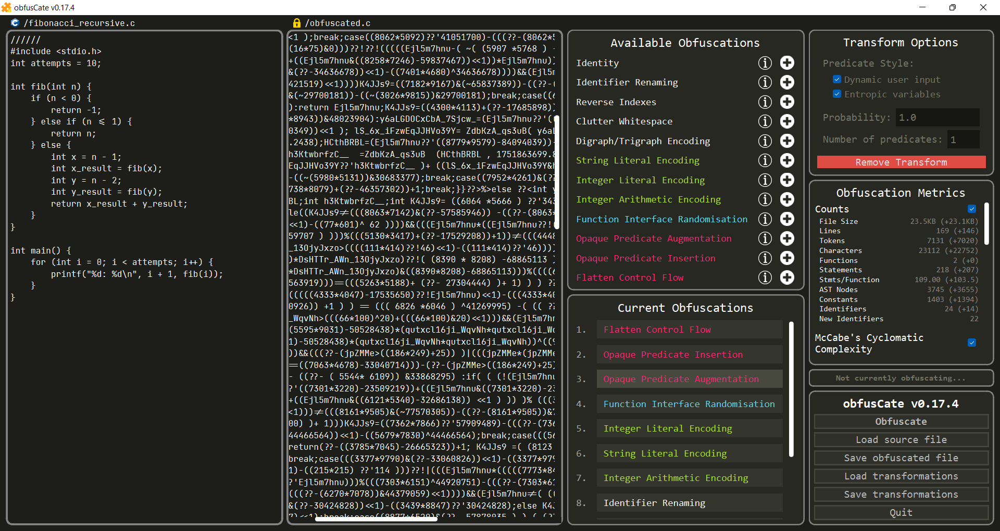

[//]: # (Hello! This README.md documentation file is a Markdown file, and so if you're reading this,)
[//]: # (you aren't reading it in the intended way! It's probably still readable but some parts are)
[//]: # (just going to look a lot like code. Ideally, you should use a markdown renderer to view the)
[//]: # (intended contents of this file, for example using an applicable virtual studio code extension.)

***</img> obfusCate*: An automated, approachable C source-to-source obfuscator**
===============

</img>

</img>

## **Table of Contents**
----
1. [**Introduction**](#1-introduction)

2. [**Installation**](#2-installation)

3. [**Usage**](#3-usage)

    3.1. [**Running the Program**](#31-running-the-program)

    3.2. [**Making your program amenable to obfuscation**](#32-making-your-program-amenable-to-obfuscation)

    3.3. [**Supported Transformations**](#33-supported-transformations)

    3.4. [**Supported Complexity Metrics**](#34-supported-complexity-metrics)

    3.5. [**CLI/GUI Options**](#35-cligui-options)

    3.6. [**GUI Shortcuts**](#36-gui-shortcuts)

4. [**Project Structure / Documentation**](#4-project-structure--documentation)

    4.1. [**Project Structure**](#41-project-structure)

    4.2. [**Documentation**](#42-documentation)

5. [**Testing**](#5-testing)

    5.1. [**Running Tests**](#51-running-tests)

    5.2. [**Unit, Integration and System Testing**](#52-unit-integration-and-system-testing)

    5.3. [**Testing Obfuscation Correctness**](#53-testing-obfuscation-correctness)

6. [**Acknowledgements**](#6-acknowledgements)

<br></br>

## **1. Introduction**
----

###

**ObfusCate** is a C source-to-source obfuscator, meaning that it takes programs written in the C programming language, and translates them into obfuscated programs also written in the C programming language, which perform the same functionality but are incomprehensible and harder to understand. 

obfusCate aims to provide a complete, whole package that makes C program obfuscation easy and approachable like never before - everyone should be able to secure their code, regardless of their knowledge about compiler and language design and information security! By providing a seamless and responsive GUI interface with flexible, modular obfuscation tools and a whole host of code complexity metrics and helfpul tooltips, we aim to enable *anybody* who wants to obfuscate their code to be able to do so, without having to battle with the interfaces of other complicated tools.

For those that cannot access (or would rather not access) a GUI interface, we also provide a menu-driven CLI interface that should allow users to easily obfuscate their C code. For the power users out there, you can even run the program as a single command-line command if you provide the list of obfuscation transformations to use in JSON format (alongside relevant options, of course). 

###

<br></br>

## **2. Installation**
----
The following steps are all that is needed for installation:

1. Make sure Python 3.10 or later is installed on your system, and is being used by your python path. You can check this using the command 

    ```
    > python3 --version
    ``` 
    
    or perhaps `python --version` or `py --version`, depending on your python path setup options. Make note of your python command, and use it from here on. 

2. In the project root directory, run the command

    ``` 
    > python3 -m pip install -r requirements.txt
    ```

    to install the required python modules. *Hopefully*, installation of the *libclang* module will automatically install clang on your system if it is not already installed. If not, please install clang using normal procedures. 

3. Everything needed to run the project should now be installed! You can see the [Usage section](#3-usage) to see how you are intended to run the program!

*Note:* Alternatively, you can just try running some install scripts I have set up that will try and determine your python executable alias for you - but there is no guarantees that these will work for your OS! On Windows open Powershell / Windows Terminal / cmd and run `./install.bat`, and on Linux / Mac open a terminal and run `./install.sh`. This should complete this installation process for you.

<br></br>

## **3. Usage**
----

### **3.1. Running the Program**
Provided that you have run the setup commands in the [**Section 2**](#2-installation), you should have all required libraries installed. As such, run the command:

```
> python3 obf_gui.py input_file.c
```

replacing `python3` with `python` or `py` with your python path, and `input_file.c` with the name of the C file that you would like to obfuscate. A few such example files are included in the `test/data/` directory if you would like. You can also alternatively run

```
> python3 obf_gui.py input_file.c output_file.c
```

replacing `output_file.c` with the name of the output file you would like to use - this will be written to when you save or exit. For comprehensive usage information outside of this, including a list of available arguments, please see sections [**3.5**](#35-cligui-options) and [**3.6**](#36-gui-shortcuts) below, or run the command

```
> python3 obf_gui.py --help
```

for more usage info.

To instead access the command-line interface, run either of the below commands, using the same arguments as the GUI commands:

```
> python3 obf_cli.py input_file.c
```

```
> python3 obf_cli.py input_file.c output_file.c
```

Again, please see sections [**3.5**](#35-cligui-options) and [**3.6**](#36-gui-shortcuts) below, or run the below command for more usage info.

```
> python3 obf_cli.py --help
```

Your obfuscated programs are then perfectly syntactically and semantically valid C programs, which are targeted towards Clang but should work on any modern compiler including gcc. Note that if you use the **digraph / trigraph encoding** obfuscation option most modern compilers will have these off by default, requiring you to provide a **--trigraphs** flag. They might still spam you with warnings, so you should probably include **-Wno-everything** in Clang or an equivalent for other compilers, to free up your terminal. So, an example of using Clang to compile an obfuscated program with digraphs/trigraphs might like look like e.g.

```
> clang -o obfs obfs.c --trigraphs -Wno-everything
> ./obfs
```

**Important Note**: Please be aware that the very first obfuscation you run will likely take a few seconds, because patching of the parser means that it has to be recompiled by Yacc. The file `yacctab.py` must be generated in the project directory so that this parser can be used, and this tends to take a few seconds to build. After this has been built, you should not need to build it again so long as you do not delete the file.

<br>

### **3.2. Making your program amenable to obfuscation**

There are several steps you can take to make your program more amenable to obfuscation and allow more effective transformations, as there are a few cases in which the program behavious cautioutsly in case it cannot be 100% sure about certain properties of your program (e.g. side effects), and there are many things that it is simply not intelligent enough to reason about with regards to semantics. The following are suggested ways to make your program more amenable (and how they help!)

1. **Move as much code out of the `main()` function as possible** - due to certain limitations and to make it easier to preserve certain properties, some obfuscations are not applied or applied in limited effect to the `main()` function - for example, opaque predicate insertion or augmentation will not occur in `main`. To overcome this, put as much code as possible outside of this function, even if it means taking your current main body and putting it in some other function `main2(int argc, char *argv)` which you then just immediately call from `main` using `main2(argc, argv)`.

2. **Store the results of function calls as variables** - for some transformations (such as arithmetic encoding), expression type analysis is used to infer the type and potential for side effects in expressions. Although functions may return e.g. integer types, these are still not encoded if placed within expressions, because obfusCated cannot easily assert any guarantees about whether `f()` has side effects on the rest of the program, for example by setting globals. So for example instead of using `x = f() + g()`, please write `a = f(); b = g(); x = a + b`.

3. **Store the results of expressions with side effects (e.g. `i++`) as variables** - for similar reasons as above, to make it easier for obfusCate to understand when it can transform your code.

4. **Create large bodies of code and complicated expressions** - as a result of no methods currently implementing techniques such as function merging, variable splitting/merging, etc., the obfuscated code is bound by the complexity of the given code. So obviously, if you can inline some function calls to create large functions, or combine multiple calculations into one huge expression, this will aid in creating more complex obfuscations (you can think of this as a bit of a preprocessing step involving some manual obfuscation!).

5. **Use integers over floats where possible** - obfusCate of course does work with float types, but many techniques are limited to integers (e.g. arithmetic encoding), and many techniques are not particularly stealthy without them due to lengthy and obvious conversions, so where it is possible to downcast to integers for your intermediary code steps (without losing accuracy, functionality, etc.) - it is recommended that you do so.

6. **Check the limitations of each method** - although most methods will work with almost every standard C feature, there are some limitations on certain methods, or on certain options of certain methods (e.g. no function signatures with minimised identifier renaming). These are sometimes due to limitations in `pycparser`, sometimes due to the complexity of supporting such a feature (e.g. even though it is supported, anonymous structs/unions cause *so many* issues...). Make sure you're not using any features that conflict with the options you want to use!

<br>

### **3.3. Supported Transformations**

Currently supported transformations are listed below. Please see relevant report / documentaton / GUI tooltips for further explanations.

 - **Identity**: Does nothing. <br>
 *Options*: None.
 - **Identifier Renaming**: Replace the names of identifiers in code. <br>
 *Options*:
    - Style
        - Complete Randomness (q3_fg4nif56fj)
        - Only Underscores (____________)
        - Minimal Length (a, b, c, d, ...) 
        - Blocks of I's and l's (IllIIlllIlllIIl)
    - Minimise identifiers (Yes/No)
- **Array Index Reversing**: Probabilistically reverse indexes of arrays, making `A[i]` into `i[A]`. <br>
*Options*:
    - Probability (`0-1`)
- **Whitespace Scrambling**: Remove/jumble code indentation <br>
*Options*:
    - Target Line Length (1+)
    - Add Line Padding (Yes/No)
- **Digraph / Trigraph Encoding**: Probabilistically encode program symbols as two character digraphs or three character trigraphs (e.g. `{` == `<%` == `??<`). <br>
*Options*:
    - Encoding Style
        - Digraphs (e.g. `<%%>`)
        - Trigraphs (e.g. `??<??>`)
        - Mixed Digraphs/Trigraphs (e.g. `??<%>`)
    - Probability (`0-1`)
- **String Literal Encoding**: Encode strings using character arrays, string concatenation, and alternate character representations. <br>
*Options*:
    - Encoding Style
        - Octal (e.g. `"\123\165\155\72""\40\45\144\x0A"`)
        - Hexadecimal (e.g. `"\x53""\x75""\x6d\x3a""\x20\x25\x64""\x0A"`)
        - Octal/Hexadecimal (e.g. `"\x53""\165\155""\x3a\x20\x25\x64""\x0A"`)
        - Octal/Hexadecimal/Regular (e.g. `"\123""u\155\x3a\40""%""d\x0A"`)
- **Integer Literal Encoding**: Encode integers as compound expressions, e.g. `5` == `((8129 * 3155) - 25646990)`<br>
*Options*: None.
- **Arithmetic Encoding**: Encode integer arithmetic operations through the use of Boolean Arithmetic identity substitution, e.g. `x + y` == `((x | y) << 1) - (x ^ y)` <br>
*Options*:
    - Recursive depth (`0+`)
- **Function Interface Randomisation**: Insert spurious arguments into function signatures and/or randomise the order of their arguments. <br>
*Options*:
    - Extra arguments (`0+`)
    - Randomise Argument Order (`Yes`/`No`)
- **Opaque Predicate Augmentation**: Augment existing conditionals in code with opaque predicates, whose value is known to us but is not immediately obvious at deobfuscation time. <br>
*Options*:
    - Predicate argument style
        - Dynamic user input (parameters)
        - Entropic variables (random numbers)
    - Probability (`0-1`)
    - Number of predicates per condition (`0+`)
- **Opaque Predicate Insertion**: Insert new conditionals in the code at varying granularities using opaque predicates, whose valeu is known to use but is not immediately obvious at deobfuscation time. <br>
*Options*:
    - Predicate Styles
        - Dynamic user input (parameters)
        - Entropic variables (random numbers)
    - Predicate Granularities
        - Procedural
        - Block 
        - Statement
    - Predicate Kinds
        - Check: `if (TRUE PREDICATE) { YOUR CODE }`
        - False: `if (FALSE PREDICATE) { BUGGY CODE }`
        - Else true: `if (TRUE PREDICATE) { YOUR CODE } ELSE { BUGGY CODE }`
        - Else false: `if (FALSE PREDICATE) { BUGGY CODE } ELSE { YOUR CODE }`
        - While false: `while (FALSE PREDICATE) { BUGGY CODE } `
        - Either: `if (ANY PREDICATE) { YOUR CODE } else { YOUR CODE }`
    - Number to insert per function (`0+`)
- **Control Flow Flattening**: Flatten the control flow graph of the given function, encoding each basic block to be a case inside a while-loop-switch-statement dispatch structure. <br>
*Options*:
    - Case Expression Style
        - Sequential Integers (e.g. `0`, `1`, `2`, `3`, `...`)
        - Random Integers (e.g. `-5`, `4593`, `3459`, `-7365`, `...`)
        - Random Enum Members (e.g. `case A`, `case B`, `case C`, `...`)
    - Randomise Case Order (`Yes`/`No`)

<br>

### **3.4. Supported Complexity Metrics**

Currently supported code complexity metrics are listed below. Except where qualitative (e.g. a rating description), metrics are provided for the obfuscated program, alongside delta (change) values that describe how the obfuscated program differs from the original. Please see relevant report / documentaton / GUI tooltips for further explanations.

- **Aggregates**: General aggregate information (totals and averages)
    - File size
    - Lines
    - Tokens 
    - Characters
    - Functions
    - Statements
    - Statements per function
    - AST Nodes (for pycparser AST)
    - Constants
    - Identifiers
    - New Identifiers (from obfuscation)
- **McCabe's Cyclomatic Complexity Index**: Measurement of the number of paths through code; roughly indicative of the complexity of code's structure. All **original** measurements indicated below are by the original definition for structured programs, incrementing on control flow structures. The **new** measurements are based on the definition from a control flow graph `M = E - N + P`, where labels, gotos etc. are considered to make this control flow graph representation.
    - New Cyclomatic Complexity Rating
    - Original Cyclomatic Complexity Rating
    - Source New Cylcomatic Complexity Rating
    - Source Original Cyclomatic Complexity Rating
    - Average New Cyclomatic Complexity Index
    - Average Original Cyclomatic Complexity Index
    - Average Myers' Interval
    - Total New Cyclomatic Complexity Index
    - Total Original Cyclomatic Complexity Index
    - Total Myers' Interval
    - Average Nodes
    - Average Edges
    - Total Nodes
    - Total Edges
- **Cognitive Complexity Index**: a new measure based on cyclomatic complexity that instead aims to measure software *maintainability* by accounting for common complexity sources like nested control flow structures and recursion, etc.
    - Average Cognitive Complexity 
    - Max Cognitive Number
    - Total Cognitive Number
    - Cognitive Number Standard Deviation
    - Average Nesting Depth
    - Max Nesting Depth
    - Nesting Depth Standard Deviation
- **Halstead Complexity Measures**: measures for software complexity based on language features (the use of operators/operands), aiming to provide estimates for programmer effort etc.
    - Program Vocabulary
    - Program Length
    - Program Estimated Length
    - Halstead Volume
    - Halstead Difficulty
    - Halstead Effort
    - Estimated Time to Program
    - Estimated Delivered Bugs
- **Maintainability Index**: a metric often used by code analysis tools, which combines aggregate information, cyclomatic complexity and Halstead volume.
    - Maintainability Index
    - Index Rating
    - Virtual Studio (VS) Bounded Index
    - Virtual Studio (VS) Index Rating

<br>

### **3.5. CLI/GUI Options**
- `-h`, `--help`: Displays the help menu.
- `-v`, `--version`: Displays the program's name and current version.
- `-L`, `--noLogs`: Stops a log file being created for this execution.
- `-S`, `--seed x`: Initialises the program with the random seed x (some integer).
- `-p`, `--progress`: Outputs obfuscation pipleline progress (transformation completion) during obfuscation.
- `-c`, `--save-comp`: Saves the selected composition of obfuscation transformations as a JSON file to be reused.
- `-l`, `--load-comp file`: Loads a given JSON file containing the composition of obfuscation transformations to use.
- `-m`, `--no-metrics`: Disables calculation of code complexity metrics for the obfuscated programs.
- `-a`, `--no-alloca`: Disables use of alloca() to replace Variable Length Arrays (VLA) in the program whilst control flow flattening, as this is not defined in the C standard and may not be available in all systems (though it is in most).
- `-u`, `--unpatch-parser`: Unpatches the parser/lexer/grammar used by yacc, such that the default pycparser CParser class `yacctable.py` is used. Disabling the patch will mean you cannot use labels with the same name as defined types, but may fix any unknown issues that arise due to patching.

<br>

### **3.6. GUI Shortcuts** 
- `Ctrl+R`: Obfuscate program
- `Ctrl+D`: Delete selected transform
- `Ctrl+S`: Save obfuscated C file
- `Shift+S`: Save obfuscation composition scheme
- `F11`: Enter/exit fullscreen
- `Esc`: Deselect selected transform
- `Up` / `Ctrl+B`: Select previous transform
- `Down` / `Ctrl+Space`: Select next transform
- `Ctrl+Up`: Move selected transformation up in composition
- `Ctrl+Down`: Move selected transform down in  composition
- `Ctrl+C`: Copy selected transform
- `Ctrl+V`: Paste copied transform

<br></br>

## **4. Project Structure / Documentation**
----

### **4.1. Project Structure**

This project is relatively large in scope. As such, I roughly describe the file structure below to help you find what you're looking for:

- `.github/workflows/test.yml`: the GitHub actions Continuous Integration (CI) testing script
- `app/` - The main application code directory
    - `graphics/` - Application graphics (images/fonts)
    - `obfuscation/` - The main obfuscation code logic
        - `__init__.py` - Python packaging file
        - `cli.py` - Command-line interface subclasses of the different obfuscation methods, providing menu-driven interfaces for creating new transformations and for editing existing ones
        - `encoding_obfs.py` - Implementation for encoding obfuscations, including: string literal encoding, integer literal encoding, and arithmetic encoding
        - `expression_analysis.py` - Implementation of expression type and mutability analysis
        - `gui.py` - Graphical user interface subclasses of the different obfuscation methods, providing default instantiation methods and graphical interfaces for editing existing transformations
        - `identifier_analysis.py` - Implementation of identifier liveness and usage analysis
        - `lexical_obfs.py` - Implementations of lexical obfuscations, including: identifier renaming, index reversal, whitespace cluttering, and digraph/trigraph encoding
        - `pipeline.py` - The implementation of the obfuscation pipeline class.
        - `procedural_obfs.py` - Implementation for procedural obfuscations, which only includes function interface randomisation
        - `structural_obfs.py` - Implementation for structural obfuscations, including: opaque predicate augmentation, opaque predicate insertion, and control flow flattening
        - `utils.py` - Miscallaneous utilities, including the `ObfuscationUnit` base clase and identity transformation among other things
    - `__init__.py` - Python packaging file
    - `cli.py` - General command line interface implementation
    - `complexity.py` - Implementation of code complexity metrics
    - `config.py` - Implementation of config information, including default settings and key bindings.
    - `debug.py` - Implementation of custom logging and debug utilities.
    - `gui.py` - General graphical user interface implementation
    - `interaction.py` - IO & User interaction utilities: `CSource` class, system argument handling, generic IO methods (user inputs, outputs, file handling, etc.), patches for pycparser.
    - `utils.py` - Miscallaneous project utilities
- `compositions/` - Directory for storing obfuscation compositions.
- `logs/` - Directory for storing any log files, if enabled
- `tests/` - Main testing directory
    - `data/` - Main testing data
        - `benchmarks/` - C benchmark programs
        - `compositions/` - Obfuscation compositions created for unit testing
        - `constructs/` - C files each targetting different program constructs
        - `examples/` - C files targetting typical program examples (e.g. quick sort, finding primes, fibonacci) and stress tests
    - `testing/` - Temporary directory used while running tests; can be safely ignored
    - `__init__.py` - Python packaging file
    - `test_cli.py` - CLI unit tests
    - `test_compositions.py` - Obfuscation composition correctness testing
    - `test_gui.py` - GUI unit tests
    - `test_obfuscation.py` - Obfuscation method correctness testing
    - `test_utils.py` - Utility function unit tests
- `utils/fake_libc_include/*` - Safely ignore this. Standard library header file handling for pycparser. Code is taken from pycparser (see the [**Acknowledgements**](#6-acknowledgements)) and slightly modified
- `bugs.md` - List and explanation of known bugs
- `install.bat` - Windows bat automatic install script
- `install.sh` - Linux/Mac bash automatic install script
- `obf_cli.py` - The python script for running the program CLI
- `obf_gui.py` - The python script for running the program GUI
- `README.md` - This documentation file.
- `yacctab.py` - (may not exist until run) Safely ignore this. The automatically generated patched parser file; not directly my code

<br>

### **4.2. Documentation**

Much of the project's functionality is created by extending the pycparser Abstract Syntax Tree (AST) `NodeVisitor` class, which defines an interface for in-order traversal of ASTs. This defined **49 unique methods** for visiting each AST node class - as such, documentation of these methods tend to be very repetitive and regurgitative within such classes, and as such provided explanation will primarily focus on what the method does *aside from* simply traversing the AST, with mention to its traversal only being discussed if necessary (e.g. using a different traversal order). This allows documentation to focus on key specifics and implementation details, and reduces repetitiveness - I focus on clarity, readability, and brevity. For any such `NodeVisitor` subclass, be aware that methods prepended by `visit_` are for visiting a specific AST node class, such as e.g. `visit_FuncDef`, traversing that node.

Documentation regarding the creation of this project, its motivation, background research, design decisions, management, evaluation and such can be found in the supporting final dissertation report pdf. Please see there for more detail. A `bugs.md` file is also included to provide more detailed documentation of the few specific known issues that cannot be easily fixed. This `README.md` file also contains some helpful documentation to get you started using the documentation. Apart from that, all other documentation can be found within file-, function- and statement-level comments throughout the code.

<br></br>

## **5. Testing**
----
Continuous integration with Github Action assures me that the code definitely runs on the latest Mac, Ubuntu and Windows images, but I've only been able to manually test on **Windows 11**, **Rocky Linux** and **Ubuntu** - so no guarantee there are no OS-specific issues on other systems. At the very least given that the tests pass it is likely that at least the CLI version should work on most systems.

<br>

### **5.1. Running Tests**
Provided that you have run the setup commands in the [**Section 2**](#2-installation), you should have **pytest** installed. As such, run the command:

```
> python3 -m pytest --capture=sys --verbose tests
```

replacing `python3` with `python` or `py` with your python path as is necessary. This will run the full test suite, including unit, integration, system and obfuscation correctness tests. As such, you can expect that these tests will take a while to run purely because of the obfuscation correctness testing (on default settings this takes about 5 minutes for me).

If you navigate to `tests/test_obfuscation.py`, you can change the value of the `INTEGRATION_TEST_STYLE` variable to be different `UsedDepth` enumerated values, to run obfuscation correctness tests that fit your needs. Note that these test cases grow exponentially, so you can roughly expect (on a standard modern laptop, note these are rough estimates):
- `UsedDepth.NONE`: 0 seconds, 0 tests
- `UsedDepth.LIGHTEST`: 5 minutes, around 1,000 tests
- `UsedDepth.LIGHT`: 1 hour, around 7,500 tests
- `UsedDepth.MEDIUM`: 16-24 hours, around 150,000 tests
- `UsedDepth.HEAVY`: 120-150 hours, around 1,000,000 tests
- `UsedDepth.EXTREME`: 600-800 hours, around 5,000,000 tests

The test scheme that was run for this project was `MEDIUM`. Generally, `LIGHTEST` should be run for very minor bugfixes like typos, etc., and any significant change should run at least a `LIGHT` test again. Every few updates `MEDIUM` should be performed to ensure that everything is still in working order. If you want to run the rest of the tests without the correctness testing, you should set this to `NONE` so you don't have to wait a long time.

<br>

### **5.2. Unit, Integration and System Testing**
Unit tests are found in the `tests/test_*.py` files, and are designed to test different aspects of the program's utilities, classes, command line interface and graphical user interface. At the time of writing, there are currently **115** implemented unit tests.

<br>

### **5.3. Testing Obfuscation Correctness**
Obfuscation correctness uses automatically generated tests, with customisable parameters to control the number of tests generated (see [**Section 6.1**](#61-running-tests) for more information, or the code in `tests/test_obfuscation.py`). Tests vary across a range of example programs each testing different C features, and randomise the parameters that are used in obfuscation methods also. Correctness testing is split into three phases:

- **Single Method Tests**: Where compositions containing singular transforms are rigorously tested for all possible (where bounded) possible input parameters, for all `n` transforms, across a set of programs. This is to ensure individual methods are working as intended.
- **Double Method Testing**: Where compositions containing pairs of transforms are rigorously tested for lots of possible input parameters, for all possible pairs of transforms (`n^2` pairings), across a set of programs. This is to ensure that no bugs are introduced with the integration and interaction of different methods (for example a bug introduced when mutating the AST in one method might not cause a problem during its operation, but might cause a problem during the second).
- **Max Method Testing**: Where compositions containing random orderings of all `n` transforms are tested over several sets of possible input parameters, across a set of programs. This obviously cannot be exhaustive, but is essentially an extreme form of integration testing / system testing in which all methods are applied at once, in an attempt to find very niche edge cases and bugs in the implementation that do not reveal themselves until multiple obfuscations have been applied in sequence. 

The intention is that through the implementation of these three testing schemes, performing tens of thousands of tests in each, we can be reasonably sure that we have created a strong, correct implementation that is likely to work for most real-world programs.

<br></br>

## **6. Acknowledgements**
----
**[1] pycparser**, created primarily by Eli Bendersky, was used heavily in the creation of this project, providing a C source code lexer, parser and generator created using yacc, which provides an intuitive pythonic interface for generating, traversing and manipulating Abstract Syntax Trees (ASTs) of C source code programs. In addition to using the library, all files in the ***utils/fake_libc_include/*** directory are code included (and very slightly modified) from pycparser in order to allow programs using standard library headers to be modified. See: *https://github.com/eliben/pycparser*

**[2] clang** is used by pycparser to preprocess C files before it begins to parse them. See: *https://clang.llvm.org/*

**[3] JetBrains Mono** is packaged with the installation, and one of its font files is found in the ***app/graphics/fonts/Jetbrains-Mono/*** directory. This font is a clean and clear monospace font with ligature support, used to render C code in the GUI interface. See: *https://www.jetbrains.com/lp/mono/*

**[4]** **cppreference.com** was used as a source for several example C programs used as test cases for testing the code. In particular, they were used as they provided examples of several uncommon C features (showing edge cases and niche functionalities), providing more confidence in the program's robustness. See: *https://en.cppreference.com/w/*
